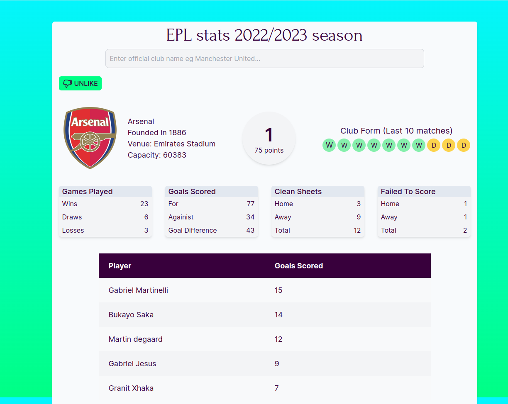

# EPL Stats 2022/2023 season

Get stats for your favorite club for the current 2022/2023 season along with some vital club information.
To access the full application,[click here](https://epl-football-stats.vercel.app/)

## Screenshot



## Table of contents

- [Overview](#overview)
  - [Features](#features)
  - [App functionality](#app-functionality)
- [My process](#my-process)
  - [Built with](#built-with)
  - [API Endpoints](#api-endpoints)
  - [Simulating fetch request with headers]('#simulating-fetch-request-with-headers')
- [Setup to local machine](#setup)
  - [Cloning from github](#clone-from-github)
  - [Installing dependencies](#installing-dependancies)
  - [Starting development server](#starting-development-server)
  - [Building for production](#production-build)
  - [Preview production build](#preview-production-build)
- [Author](#author)
- [Acknowledgments](#acknowledgments)

## Overview

### App Features

- Form input validation.
- Toggle between light and dark modes.
- Favorite a club and get its information on initial page load.
- Display premier league table on initial load if no club is set as favorite.

### App functionality

A user can search for any premier league club that plays in the current season,2022/2023. They use the official club name to
perform the search. If the name used isn't the official club name or its a name for a club that isn't in the premier league
in the current season, they will get an error notifying them of this. However, if they used a proper name for a club, the
app will fetch the stats and provided them to the user.

The user can then choose to like their favorite club. This will ensure that their favorite club information is populated once
they open the app. A user can only like one club at a time. If they like a different club after already liking a different club,
they will be notified of the same. However, they can choose to unlike the club at any time of their choosing and like a different club.

## My process

### Built with

- Semantic HTML5 markup
- CSS custom properties
- Javascript

### API Endpoints

For this application, seven(7) endpoints were used to fetch the stats for the different premier league clubs. These endpoints are:

```text
https://football-web-pages1.p.rapidapi.com/teams.json?comp=1;
https://api-football-beta.p.rapidapi.com/teams?league=39&season=2022;
https://api-football-v1.p.rapidapi.com/v3/teams?id=${id}&league=39&season=2022;
https://api-football-v1.p.rapidapi.com/v3/teams/statistics?league=39&season=2022&team=${id};
https://api-football-v1.p.rapidapi.com/v3/standings?season=2022&league=39
https://football-web-pages1.p.rapidapi.com/league-table.json?comp=1;
https://football-web-pages1.p.rapidapi.com/goalscorers.json?comp=1&team=${id}
```

### Simulating fetch request with headers

```js
const response = await fetch(url, {
	method: 'GET',
	headers: {
		'X-RapidAPI-Key': '915f65df84msh2ef701f1718c032p1f5431jsnfed3d971dc76'
	});
const result = await response.json();
console.log(result);
```

## Setup to local machine

### Cloning from github

To clone the project from the repository and open in VS Code, run the commands below from your terminal.

```text
git clone https://github.com/nicmackenzie/epl-football-stats.git
cd epl-football-stats
code .
```

### Installing dependancies

```js
npm install
```

### Running the development server

```js
npm run dev
```

### Building for production

```js
npm run build
```

### Previewing the production build

```js
npm run preview
```

## Author

- Twitter - [@nckmackenzie](https://www.twitter.com/nckmackenzie)

## Acknowledgments

Special thanks to the team from [API football](https://www.api-football.com/) for their API that provided club information and stats on matches and form, and to [Football web pages](https://rapidapi.com/football-web-pages1-football-web-pages-default/api/football-web-pages1) for their API that provided information on points and ranking as well as top scorers.
